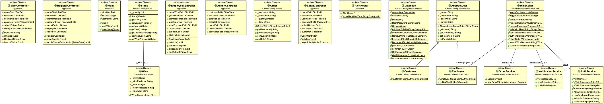
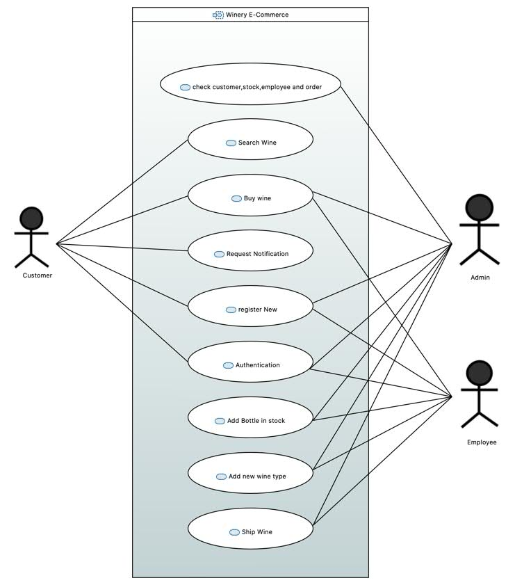

***READ ME FILE***

Author: Simone Mulazzi
Matricola 296543

**Class Diagram**


**Use Case Diagram**


**How to run**

When application.Main.java is run, programm create Database Winery.db
and Admin account.
in Login if you want log in as administrator the credentials are:  
```
username: admin
password: admin
```
Else you can create new customer with register button and create new customer